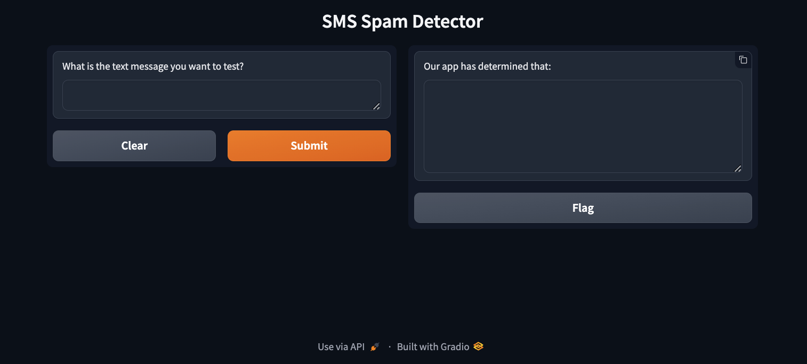

# sms_spam_detector

I worked with ChatGPT and tutor Mohammed Fauwaaz in a Tutor Session on BSC to complete this assignment.

## Overview
Created a classification solution by refactoring code from provided SMS text classifcation solution into a function that constructed a linear Support Vector Classification (SVC) model. SVC model was trained on the SMS Spam Collection dataset and used to create a Gradio app, enabling users to test text messages, with feedback on whether the message is spam or not.

## Methods
**SMS Classification Function:** 
* Set features and target variable to the appropriate columns in the SMS Spam Collection dataset: 
    * `X = sms_df['message']`
    * `y = sms_df['label']`
* Split data into training and testing sets with test size set to 33%:
    * `X_train, X_test, y_train, y_test = train_test_split(X, y, test_size=0.33)`
* Pipeline Overview: 
    * `TfidfVectorizer()` used to convert text data into numerical data
    * `LinearSVC()` used to classify text data

**SMS Prediciton Function:**
* Created variable to hold predictions
* Used conditional statements to return 'Spam' or 'Ham' based on model prediction
    * `if prediction[0] == 'ham':`
        * `return f'The text message: "{text}", is not spam.'`
    * `else:`
        * `return f'The text message: "{text}", is spam.'`

**Gradio Interface Application**
* Created Gradio interface with textboxes and corresponding labels for what each textbox is contains:
    * `inputs=[gr.Textbox(label='What is the text message you want to test?')],`

    * `outputs=[gr.Textbox(label='Our app has determined that:')]`
* Lauched application and provided shareable URL

    

## Results

The following results were generated using Gradio app to predict the classification of the test SMS messages:

|  Text | Prediction|
| :--- | :--- |
| You are a lucky winner of $5000!  | Ham  |
| You won 2 free tickets to the Super Bowl.  | Ham  |
| You won 2 free tickets to the Super Bowl text us to claim your prize.  | Spam  |
| Thanks for registering. Text 4343 to receive free updates on medicare.  | Spam  |

